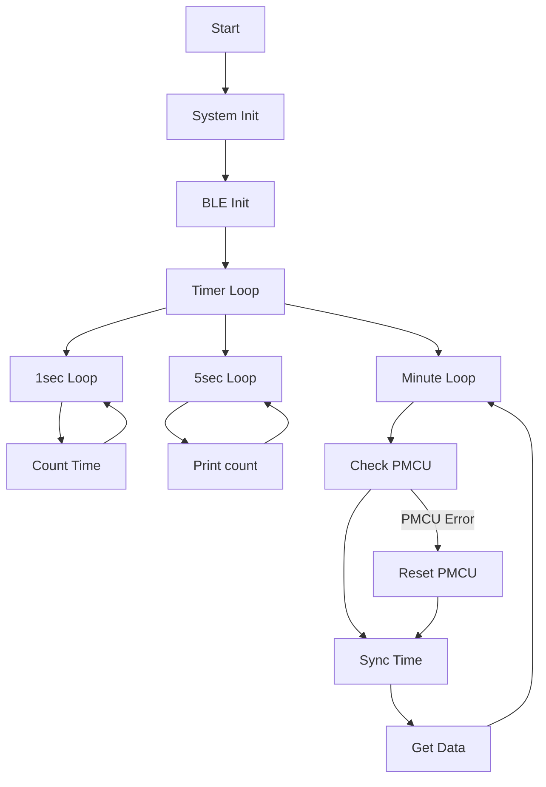

# 1	Firmware Flow Chart



# 2	Check Primary Board Code
The code below is used by the Baseboard to check wether the Primary board is working correctly or not. By sending a `CHECK_MCU` command over the USART1, the baseboard expects the PMCU to respond a `PMCU_OK` string. A flag will be set accordingly to the response of the PMCU. This flag is being used by other proceses and functions


```c
void Check_Primary_Board(void)
{
	sprintf(arQ.Buf.DESIRED_RESPONSE, "PMCU_OK");
	Clear_UART_Buffers();

	xprintf(PC, "Checking PMCU: ");
	bprintf("Checking PMCU: ");
	//HAL_Delay(200);

	xprintf(MCU, "CHECK_MCU");
	if (Get_Serial_Response())
	{
		arQ.Flg.PMCU_STAT_FLAG_OK = true;
		xprintf(PC, "%s\r\n", arQ.Buf.GSM_RESPONSE);
		bprintf("%s\r\n", arQ.Buf.GSM_RESPONSE);
	}
	else
	{
		arQ.Flg.PMCU_STAT_FLAG_OK = false;
		xprintf(PC, "PMCU Error!\r\n");
		bprintf("PMCU Error!\r\n");
	}

	Clear_UART_Buffers();
}
```


