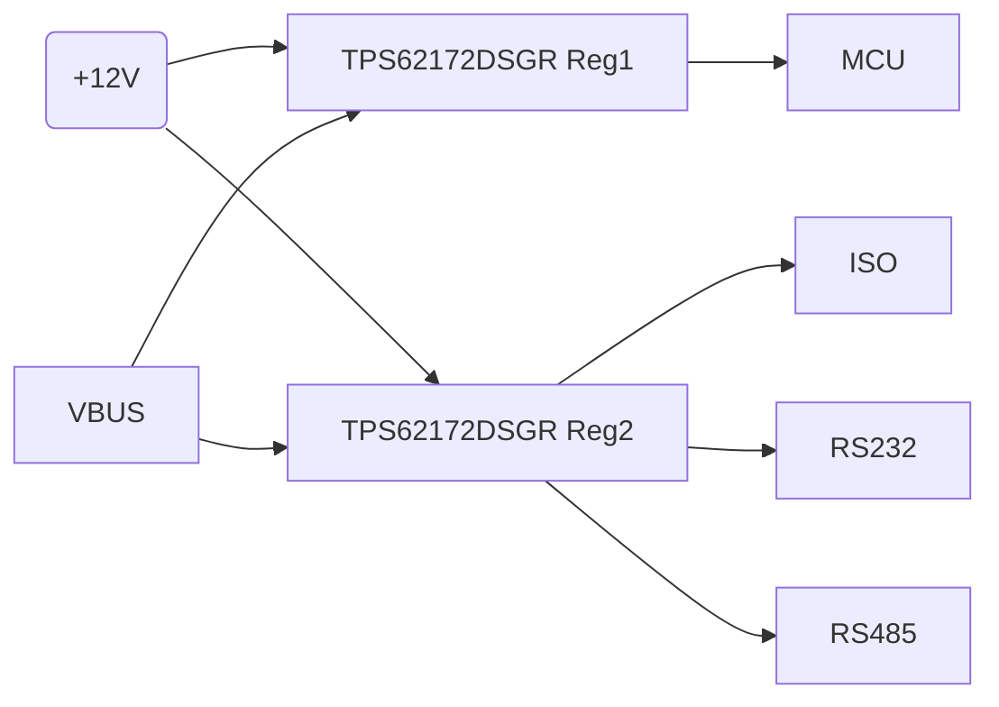

# Power Subsystem

## 3.3 Regulators

```mermaid

flowchart LR
	A(+12V) --> B[TPS62172DSGR Reg1]
	C[VBUS] --> B[TPS62172DSGR Reg1]
	B[TPS62172DSGR Reg1] --> D[MCU]
	A(+12V) --> E[TPS62172DSGR Reg2]
	C[VBUS] --> E[TPS62172DSGR Reg2]
	E[TPS62172DSGR Reg2] --> F[ISO]
	E[TPS62172DSGR Reg2] --> G[RS232]
	E[TPS62172DSGR Reg2] --> H[RS485]

```
## 3.9V Regulator

``` mermaid

flowchart LR
	A[PCDM] --> |+5V| B[TPS63060DSCT]
	B[TPS63060DSCT] --> |+3.9V| C[LTE Board]
```
