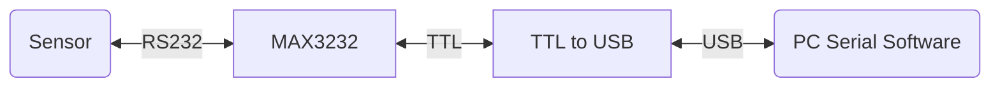

# 1	RS232 Circuit Test Procedure
To test the functionality of the RS232 circuit of the Baseboard, the following components are required.
1) Sensor - with RS232 communication protocol
2) C&DH Baseboard's RS232 Circuit
3) TTL to USB module - converts serial UART to USB. 
4) PC Serial Software -  emulates MCU commands and reading of sensor

